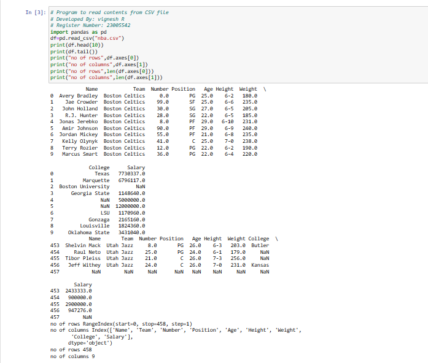

# Read-from-CSV

## AIM:
To write a python program for reading content from a csv file
## ALGORITHM:
### Step 1:
Import pandas as pd

### Step 2:
Read the CSV file using read_csv method

### Step 3:
Use head and tail method to get the required contents from the file.

### Step 4:
Use len()method to get the number of rows and columns

### Step 5:
Display the result.

## PROGRAM:
```py
# Program to read contents from CSV file
# Developed By: vignesh R
# Register Number: 23005542
import pandas as pd
df=pd.read_csv("nba.csv")
print(df.head(10))
print(df.tail())
print("no of rows",df.axes[0])
print("no of columns",df.axes[1])
print("no of rows",len(df.axes[0]))
print("no of columns",len(df.axes[1]))
```
## OUTPUT:

## RESULT:
Thus python program for reading content from a CSV file is successful.